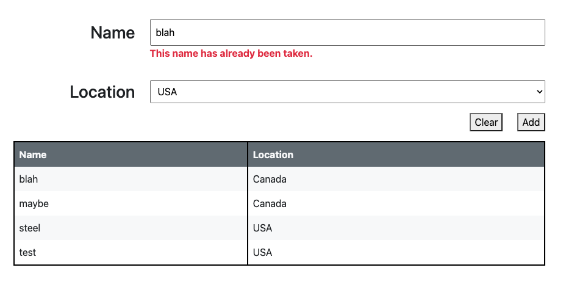

# react-interview-q1 -- Forked by Matt Jennings

## Matt Jennings Notes

- App Details:
  - All bullet points were addressed (see **Requirements** section below)
  - I was a little unclear about how to use the `isNameValid` API at **solution/src/mock-api/apis.js** so the`This name has already been taken.` errors message appears whenever:
    - `invalid name` is typed into the `Name` field per the `isNameValid` API
    - An existing name is typed into the `Name` field (like `blah` in the screenshot below):
      
  - I used CSS from [Bootstrap](https://getbootstrap.com/) with minimal custom [SCSS](https://sass-lang.com/documentation/syntax/#scss) to style the app
- How to run:
  - In root direction do the command below which installs packages to use [Vite with React](https://vitejs.dev/guide/):  
    `npm i`
  - To quickly view the app run:
    `npm run dev`
  - To build the app and then view it run the 2 commands below:
    ```
    npm run build
    npm run preview
    ```

## Instructions

Fork this repo first into your own github account. Make sure to thoroughly read the instructions and implement the react component to meet the provided requirements. Send back a link to your cloned repo. You are expected to make implementation choices around customer experience and efficiency. Please make sure to explain your choices in comments.

## Requirements

Please build the following form component


- Name input should be validated using the provided mock API to check whether the chosen name is taken or not.
- Name input should be validated as the user is typing.
- Location dropdown options should be fetched using the provided mock API.
- Component should have a responsive layout
- Component should be appropriately styled
- Unit tests are not required
